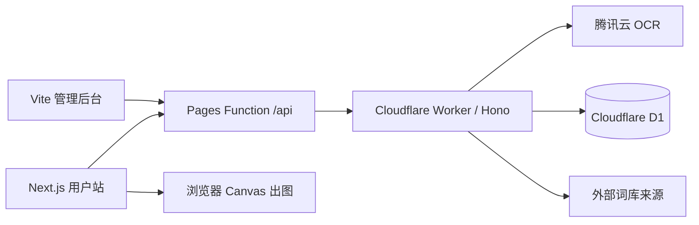

# 谐音圈图

从图片或文字中切出连续汉字，匹配同音专有名词，并自动生成圈图梗图。

## 功能

- 腾讯云中文 OCR，内置 mock 模式可离线体验
- 不依赖词边界的 2–6 字滑窗谐音匹配
- 图片输入直接在原图文字位置圈注
- 独立词库后台，支持筛选、分页、编辑和数据源同步
- 宝可梦、英雄联盟、米哈游游戏、Bangumi、历史人物、明星及音乐人等自动数据源

## 架构



用户图片和生成结果只在浏览器中处理，不持久化。生产词库存储在 D1；本地开发使用 JSON 文件。

## 本地运行

需要 Node.js 22。

```bash
cp .env.example .env.local
npm ci
npm run dev
```

默认同时启动：

- 用户站：<http://127.0.0.1:43127>
- API：<http://127.0.0.1:43128>
- 管理后台：<http://127.0.0.1:43129>

`.env.example` 默认使用 mock OCR，五张内置样例无需云端密钥。管理后台需要在 `.env.local` 设置一个本地 `ADMIN_API_TOKEN`。

## 质量检查

```bash
npm run check
```

该命令依次执行类型检查、ESLint、Vitest、用户站构建和后台构建。

## 本地一键部署

先创建两个 Cloudflare Pages 项目、一个 Worker、D1 数据库和 R2 Bucket，然后：

```bash
cp .env.deploy.example .env.deploy.local
# 填写本机部署配置；不要提交此文件
npm run deploy
```

`npm run deploy` 会按顺序执行：

1. 质量检查
2. 生成被 Git 忽略的 Wrangler 配置
3. 应用 D1 migrations
4. 部署 Worker 并同步 Worker Secrets
5. 配置 Pages 的 `API_ORIGIN`
6. 部署用户站和管理后台

也可单独执行 `npm run deploy:api`、`npm run deploy:web` 或 `npm run deploy:admin`。

本地已执行 `wrangler login` 时可不填写 Cloudflare Token；CI 必须使用最小权限 Token。

## GitHub Actions 自动部署

- `.github/workflows/ci.yml`：功能分支和 Pull Request 自动执行 `npm run check`
- `.github/workflows/deploy.yml`：推送到 `main` 后自动检查并部署全部服务

在 GitHub 仓库的 **Settings → Secrets and variables → Actions** 配置：

### Secrets

| 名称 | 必需 | 用途 |
| --- | --- | --- |
| `CLOUDFLARE_ACCOUNT_ID` | 是 | Cloudflare 账号 |
| `CLOUDFLARE_API_TOKEN` | 是 | Pages、Workers、D1 部署 |
| `D1_DATABASE_ID` | 建议 | 不填时按数据库名称查询 |
| `ADMIN_API_TOKEN` | 是 | 管理 API Bearer Token |
| `TENCENTCLOUD_SECRET_ID` | 在线 OCR 必需 | 腾讯云 OCR |
| `TENCENTCLOUD_SECRET_KEY` | 在线 OCR 必需 | 腾讯云 OCR |
| `TURNSTILE_SECRET_KEY` | 否 | 防滥用 |

### Variables

| 名称 | 示例 |
| --- | --- |
| `CF_WORKER_NAME` | `homophone-meme-api` |
| `CF_WEB_PROJECT` | `homophone-meme` |
| `CF_ADMIN_PROJECT` | `homophone-meme-admin` |
| `D1_DATABASE_NAME` | `homophone-meme-db` |
| `R2_BUCKET` | `homophone-meme-assets` |
| `PUBLIC_WEB_URL` | `https://<public-project>.pages.dev` |
| `ADMIN_PUBLIC_URL` | `https://<admin-project>.pages.dev` |
| `API_ORIGIN` | `https://<worker>.<subdomain>.workers.dev` |
| `WEB_ORIGINS` | 与 `PUBLIC_WEB_URL` 相同 |
| `ADMIN_ORIGINS` | 与 `ADMIN_PUBLIC_URL` 相同 |
| `OCR_PROVIDER` | `tencent` |
| `TENCENTCLOUD_REGION` | `ap-guangzhou` |
| `NEXT_PUBLIC_AUTHOR_MARK` | 可留空 |

Cloudflare Token 只授予当前账号的 Workers Scripts、Pages、D1 和 R2 所需权限，不要使用 Global API Key。

## 数据与版权

自动来源仅生成完整名称触发词，不生成名称前缀。远程图片通过 API 白名单代理并缓存，避免向浏览器暴露词库和第三方图片地址。

项目中的品牌、角色、明星及作品图片仅用于非商业原型。公开部署或商业使用前，应逐项确认商标、肖像和图片授权。更多配置见 [`docs/launch-checklist.md`](docs/launch-checklist.md)。
