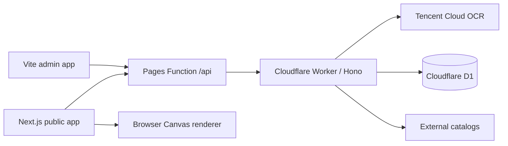

# Homophone Meme Generator

Extract adjacent Han characters from text or images, match them with homophonic proper nouns, and generate annotated meme images.

## Features

- Tencent Cloud Chinese OCR with an offline mock mode
- Custom 2–6 character sliding-window matching without word boundaries
- Direct annotation over OCR positions in uploaded images
- Separate lexicon admin app with filtering, pagination, editing, and source sync
- Automated catalogs for Pokémon, League of Legends, HoYoverse games, Bangumi, historical figures, celebrities, and musicians

## Architecture



Uploaded images and generated results stay in the browser and are not persisted. Production lexicon data is stored in D1; local development uses a JSON file.

## Local development

Node.js 22 is required.

```bash
cp .env.example .env.local
npm ci
npm run dev
```

This starts all three services:

- Public app: <http://127.0.0.1:43127>
- API: <http://127.0.0.1:43128>
- Admin app: <http://127.0.0.1:43129>

The example configuration uses mock OCR, so the five built-in samples work without cloud credentials. Set a local `ADMIN_API_TOKEN` in `.env.local` to use the admin app.

## Quality checks

```bash
npm run check
```

This runs Next.js type generation, TypeScript, ESLint, Vitest, and production builds for both browser apps.

## One-command local deployment

Create two Cloudflare Pages projects, one Worker, a D1 database, and an R2 bucket. Then run:

```bash
cp .env.deploy.example .env.deploy.local
# Fill in local deployment values. Never commit this file.
npm run deploy
```

The deploy command:

1. Runs all quality checks.
2. Generates an ignored Wrangler configuration.
3. Applies D1 migrations.
4. Deploys the Worker and updates Worker secrets.
5. Configures `API_ORIGIN` for both Pages projects.
6. Deploys the public and admin apps.

Use `npm run deploy:api`, `npm run deploy:web`, or `npm run deploy:admin` to deploy one target.

Local deployment can use an existing `wrangler login` session. CI must use a scoped API token.

## GitHub Actions deployment

- `.github/workflows/ci.yml` runs `npm run check` on feature branches and pull requests.
- `.github/workflows/deploy.yml` verifies and deploys every push to `main`.

Configure **Settings → Secrets and variables → Actions** in the GitHub repository.

### Secrets

| Name | Required | Purpose |
| --- | --- | --- |
| `CLOUDFLARE_ACCOUNT_ID` | Yes | Target Cloudflare account |
| `CLOUDFLARE_API_TOKEN` | Yes | Pages, Workers, and D1 deployment |
| `D1_DATABASE_ID` | Recommended | Resolved by database name when omitted |
| `ADMIN_API_TOKEN` | Yes | Admin API bearer token |
| `TENCENTCLOUD_SECRET_ID` | For online OCR | Tencent Cloud OCR |
| `TENCENTCLOUD_SECRET_KEY` | For online OCR | Tencent Cloud OCR |
| `TURNSTILE_SECRET_KEY` | No | Abuse protection |

### Variables

| Name | Example |
| --- | --- |
| `CF_WORKER_NAME` | `homophone-meme-api` |
| `CF_WEB_PROJECT` | `homophone-meme` |
| `CF_ADMIN_PROJECT` | `homophone-meme-admin` |
| `D1_DATABASE_NAME` | `homophone-meme-db` |
| `R2_BUCKET` | `homophone-meme-assets` |
| `PUBLIC_WEB_URL` | `https://<public-project>.pages.dev` |
| `ADMIN_PUBLIC_URL` | `https://<admin-project>.pages.dev` |
| `API_ORIGIN` | `https://<worker>.<subdomain>.workers.dev` |
| `WEB_ORIGINS` | Same as `PUBLIC_WEB_URL` |
| `ADMIN_ORIGINS` | Same as `ADMIN_PUBLIC_URL` |
| `OCR_PROVIDER` | `tencent` |
| `TENCENTCLOUD_REGION` | `ap-guangzhou` |
| `NEXT_PUBLIC_AUTHOR_MARK` | Optional public attribution |

Grant the Cloudflare token only the required Workers Scripts, Pages, D1, and R2 permissions for the target account. Never use a Global API Key.

## Data and licensing

Automated catalogs create triggers only from complete names, never generated prefixes. Third-party images are served through an allowlisted API proxy so browsers do not receive the private lexicon or upstream image URLs.

Brand, character, celebrity, and media artwork in this prototype is intended only for non-commercial testing. Verify trademark, likeness, and image rights before public or commercial use. See [`docs/launch-checklist.md`](docs/launch-checklist.md) for service and asset guidance.
